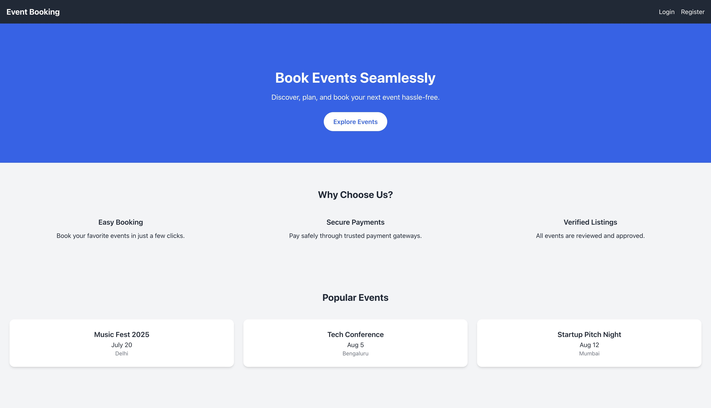

# 🎟️ Event Booking System

**Event Booking System** is a full-stack web application that allows users to browse, book, and manage event reservations. Built using the **MERN stack** with **MySQL** as the database, the platform provides secure login functionality and real-time seat availability.

### 🔐 Hero Page



---

## 🚀 Features

- User **signup** and **login** with JWT authentication  
- View a list of upcoming **events** with event details (name, location, date, total seats, available seats)  
- **Book** events based on the number of seats available  
- Realtime update of **available seats** after successful booking  
- Displays **confirmation message** upon successful booking  

**Alerts if:**

- User is not logged in  
- Number of seats requested exceeds availability  
- Simple and intuitive frontend using **React.js**  
- Backend API built with **Node.js** and **Express.js**  
- Relational data handling with **MySQL**  

---

## 🛠️ Tech Stack

- **Frontend**: React.js, HTML, CSS, JavaScript  
- **Backend**: Node.js, Express.js  
- **Database**: MySQL (via Sequelize / mysql2)  
- **Authentication**: JWT-based  

**Hosting**:  
- **Frontend**: Netlify  
- **Backend**: Render

---
# 📍 How It Works

## 👤 User Capabilities

- 📝 Register an account  
- 🔐 Login to the platform  
- 📅 View a list of all upcoming events  
- 🎟️ Book an event for:
  - Themselves
  - A group (specify number of people)
- ❌ Cancel their booking  
- 💬 Submit reviews and comments — *only allowed if the user attended the event and the event has ended*  

---

## 🛠️ Admin Capabilities

- 👤 Create new admin users  
- 📊 Access and manage the Admin Dashboard  
- 🗓️ Create new events  
- 📋 View all bookings  
- 📝 View all events  
- ✏️ Edit or update existing event details  

---

## 🔁 Booking Flow

1. **User logs in or signs up**  
2. **Upcoming events are fetched and displayed**  
3. **Each event displays available seats**  
4. **User books an event** → selects number of people  
5. **Backend validates**:
   - ✅ Login/authentication status  
   - ✅ Seat availability for the event  
6. **Booking is confirmed**:
   - Remaining seats are updated  
   - Booking is saved with user and event info  
7. **After event completion**, user can:
   - Submit a **review**
   - Write **comments**

---

## 🖥️ Live Demo

👉 **[Click Here to Explore the App](https://event-booking-system-sand.vercel.app/)**

Login as admin to use it at full potential - 
```bash
username : admin1@gmail.com
password : 1234
```
---

## 📦 Installation

### 1. Clone the Repository

```bash
git clone https://github.com/your-username/event-booking-system.git
cd event-booking-system
npm install
npm start

<!-- 2. Set Up the Backend -->

<!-- Navigate to the backend folder: -->
cd server

<!-- Install dependencies: -->
npm install

<!-- Create a .env file with the following: -->
PORT=4000
JWT_SECRET=YOUR_JWT_SECRET
DB_HOST=YOUR_HOSTNAME
DB_PORT=YOUR_DATABASE_PORT
DB_USER=YOUR_DATABASE_USER
DB_PASSWORD=YOUR_DATABASE_PASSWORD
DB_NAME=YOUR_DATABASE_NAME

<!-- import the event_booking_schema into your database -->
mysql -u root -p YOUR_DATABASE_NAME < event_booking_schema.sql

<!-- Start the backend server: -->
npm start

```
